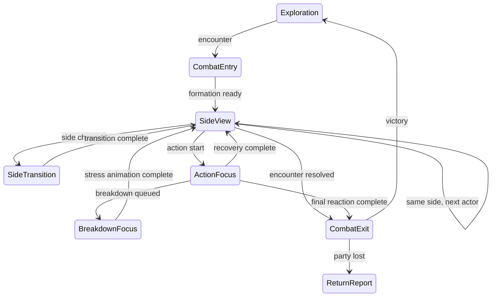
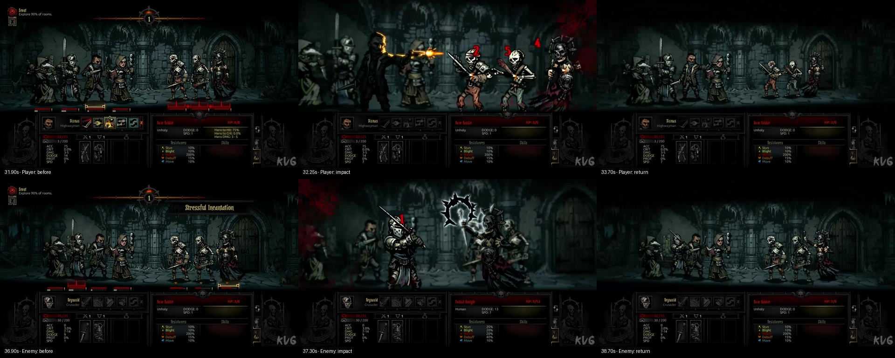

# Боевая камера Darkest Dungeon 1
## Разбор референса и спецификация для Blackstone Expedition

Версия 1.1 · 25 сентября 2026 · дополнено разбором видеозаписи

## 1. Область и достоверность

Документ описывает визуальные принципы DD1 и переводит их в требования для нашей игры. Это не реконструкция исходного движка. Числа ниже — предлагаемые настройки Blackstone Expedition, а не извлечённые параметры DD1.

Обозначения:

- **Источник** — прямо подтверждено опубликованным материалом разработчика.
- **Кадры** — видно на трёх предоставленных пользователем изображениях The Old Road, включая Blanket Fire. Они не образуют запись с известными временными метками.
- **Реконструкция** — способ воспроизвести впечатление доступными средствами; внутренняя реализация DD1 не установлена.
- **Требование проекта** — согласованное поведение нашей игры.

В версии 1.1 исследована предоставленная запись 1280×720, 60 fps, 2:47.30. Подробные интервалы просмотрены с шагом 0.1 секунды, вход в бой — 0.2 секунды, завершение — около 0.33 секунды. Это временные оценки по выборке кадров, а не измерения с точностью 1/60 секунды. Настройки камеры, версия игры и возможное преобразование fps на YouTube неизвестны. Числа из раздела 5 по-прежнему относятся к нашей игре. Подтверждённые видео-наблюдения и поправки к первоначальной реконструкции находятся в разделе 11.

## 2. Что подтверждено

**Источник.** В докладе Chris Bourassa, *A Torch in the Dark*, слайд 10, объясняется выбор боковой подачи: внимание должно оставаться на персонажах; слишком широкий ракурс ослаблял тесноту и напряжение; исследование и бой объединены общей системой ассетов. [Презентация Red Hook на GDC](https://media.gdcvault.com/gdc2016/Presentations/Bourassa_Chris_a%20torch%20in.pdf#page=10).

**Кадры.** Герои расположены слева, противники справа. Строй и направление противостояния сохраняются между изображениями. Нижние индикаторы привязаны к участникам; название действия выводится отдельно. Участники, связанные с атакой Blanket Fire, отмечены цветными элементами у основания.

**Кадры.** В соседних изображениях меняются взаимные перекрытия фигур и элементов декора. Это совместимо с параллаксом и изменением композиции, но не доказывает настоящую трёхмерную камеру. Точные масштабы нельзя достоверно сравнить без одинакового размера исходных кадров и известного момента записи.

**Вывод для проекта.** Основная задача камеры — сделать читаемыми действующего персонажа, его цель и результат. Простое увеличение всей сцены не решает перекрытие героев друг другом.

## 3. Четыре независимых компонента

| Компонент | Что меняет | Что запускает |
|---|---|---|
| Общая композиция | Центр кадра и общий масштаб поля | Начало/конец боя, изменение доступной области |
| Ракурс стороны | Относительное смещение слоёв и глубину строя | Смена стороны действующего участника |
| Акцент действия | Масштаб и порядок рисования атакующего и целей | Начало и завершение конкретного действия |
| Особое событие | Фокус одного героя, ореол, реплику | Слом воли или душевный подъём |

Это **реконструкция для Blackstone**, а не утверждение об архитектуре DD1. Акцент действия может включаться для каждого выстрела, сохраняя ракурс стороны. Так соблюдаются оба пожелания: плавный бой без возвратов камеры между союзниками и заметная атакующая пара.

## 4. Состояния и переходы

Каждое состояние хранит actorId, targetIds, side, startTime, duration и идентификатор действия. Запоздалые события завершённого действия не должны менять новую композицию.

### Начало боя

1. Остановить ходьбу и зафиксировать мировые позиции.
2. Найти композицию, включающую оба строя, головы, оружие и пол под ногами.
3. Плавно приблизить поле; оставить интерфейс неподвижным.
4. Дождаться проявления противников и разрешить управление.

В нашей игре бой остаётся в текущем коридоре или комнате. При четырёх героях наезд ограничивается доступным пространством: нельзя увеличивать сцену ценой обрезанных крайних участников.

### Ход стороны

Ракурс хранится до фактической смены стороны в очереди инициативы. Два последовательных врага не вызывают два разворота. Это не командная фаза: очередь остаётся индивидуальной и может чередовать стороны.

Под текущим участником постоянно виден маркер. Во время разрешения действия маркер остаётся у атакующего, даже если модель боя уже рассчитала следующего участника.

### Атака

1. До начала анимации зафиксировать атакующего и все цели.
2. Поднять их над остальным строем по порядку рисования.
3. Плавно увеличить относительно точки опоры ног.
4. В событие impact синхронно применить урон, звук, числа и реакцию цели.
5. Удержать акцент до завершения значимой реакции.
6. Вернуть обычный масштаб, сохранив текущий ракурс стороны.

Выделение не перемещает персонажа в другой ранг и не меняет координаты модели боя. Изменяется только отображение. На промахе пара остаётся выделенной до окончания действия, но реакция получения урона не запускается.

### Групповая атака и поддержка

Все цели включаются в один набор. Нельзя последовательно переключать камеру между ними для одного одновременного удара. Масштаб подбирается по объединённой области фигур; при большом наборе допускается меньший акцент. Для самолечения достаточно одного героя. Для лечения союзника выделяются лекарь и получатель; сторону ракурса определяет действующий герой.

### Крит, смерть, слом воли

- Крит: сохранить геометрию обычного удара; усилить акцент надписью и звуком. Короткая тряска — опциональный предлагаемый эффект, не подтверждённый здесь замер DD1.
- Смерть: удержать позу получения урона, затем существующий переход в чёрный силуэт и исчезновение. Не удалять визуальный объект до завершения реакции.
- Слом: после реакции попадания временно нейтрализовать ракурс сторон, оставить остальных обычного размера и увеличить пострадавшего. Одновременно запустить красную реплику, LowMorale и ореол. По окончании восстановить сохранённую сторону; новый ход разрешить после возврата.
- Завершение боя: дождаться реакции последней цели. Победа не должна обрывать смерть или особую анимацию на полуслове.

## 5. Рекомендуемые параметры Blackstone

Все значения в таблице — **проектные**, а не измерения DD1. Масштабы относительные, длительности в миллисекундах.

| Параметр | Стартовое значение | Примечание |
|---|---:|---|
| Общий зум боя | 1.065 | Уже используется; ограничивать вписыванием строя |
| Приближение к бою | 450–750 | Подобрать на фоне появления врагов |
| Переход ракурса стороны | 350–550 | Только при смене side |
| Масштаб атакующей пары | 1.12 | Уже добавлен; отдельный от общего зума |
| Вход акцента пары | 120–180 | Быстрее общего движения камеры |
| Возврат пары | 180–260 | После реакции цели |
| Масштаб слома | 1.22 | При нейтральном общем плане |
| Вход/выход слома | 180 / 350 | Время самой анимации берётся из клипа |
| Сдвиг бокового ракурса | до 2.8% высоты поля | Глубинные коэффициенты ниже |
| Шевеление камеры на крит | 0 по умолчанию | Сначала оценить читаемость без тряски |

Существующий выстрел Ranger: 77 кадров / 24 fps, impact на 1.3 секунде. Анимацию и урон не следует привязывать к времени завершения наезда: impact принадлежит клипу. Уменьшение интенсивности камеры не должно менять исход боя.

## 6. Как получить параллакс без 3D

Использовать общую систему координат и разные коэффициенты движения для слоёв. Не растягивать портретные спрайты по отдельным осям ради имитации перспективы.

| Слой | Коэффициент бокового сдвига |
|---|---:|
| Дальний фон | 0.12 |
| Дальние конструкции | 0.30 |
| Туман | 0.40 |
| Средний план | 0.60 |
| Пол, порталы | 1.00 |
| Передние декорации | 1.40 |
| HUD, кнопки, отчёт | 0 |

Эти коэффициенты уже присутствуют в нашем проекте. Они описывают художественную глубину, а не физическое расстояние.

Для мировой точки X:

`screenX = centerX + (worldX - cameraX - centerX) * sceneZoom + sideOffset * depth`

Масштаб фигуры вычисляется каждый кадр из базового значения:

`spriteScale = baseScale * sceneZoom * sideDepthScale * emphasisScale`

При сломе emphasisScale выбирается вместо обычного акцента атаки, а не перемножается с ним. Pivot — ступни, а не центр текстуры. Прозрачные поля атласа нельзя использовать для автоматического определения размеров тела.

Сглаживание, независимое от частоты кадров:

`value += (goal - value) * (1 - exp(-lambda * dt))`

Для перехода с точной длительностью использовать нормализованный progress и easing. Не накладывать CSS transition поверх уже сглаживаемого requestAnimationFrame: пересоздание элементов и новые целевые значения приводят к дрожанию или запаздыванию.

## 7. Приоритеты и слои

Порядок приоритетов: завершение/выход из сцены → особое событие → акцент действия → ракурс стороны → исследование. Оверлей настроек приостанавливает запуск новых действий; возвращение не перезапускает уже сыгранный impact.

Порядок рисования: фон → декорации → обычные участники → выделенные цели → атакующий → герой в особом фокусе → числа/реплики → интерфейс. Внутри обычного строя порядок стабилен и не зависит от пересоздания DOM.

Hitbox следует за отображаемой фигурой. Передний декоративный слой не должен перехватывать нажатия. Маркер активного героя и маркер цели отличаются цветом; цвет желательно дополнять формой. Подсказка цели появляется при наведении, действие выполняется по нажатию.

## 8. Сопоставление с текущим кодом

- `app.js`, цикл mission: общая battleZoom, viewBias, слои окружения.
- `combat.js`, announceTurn: смена стороны и баннер.
- `combat.js`, resolve: момент старта, impact и реакции.
- `combat.js`, draw: масштаб, точка ног, приоритет рисования и маркеры.
- `character-effects.js`: ореолы, собственный цикл появления/пульсации/исчезновения.

Что уже есть: зум боя, параллакс сторон, акцент пары 1.12, фокус слома 1.22, маркеры, синхронизация выстрела на 1.3 секунде.

Что стоит вынести в следующую реализацию: единый контроллер композиции; targetIds вместо одной цели; вычисление безопасного кадра для 1–4 героев и крупных врагов; явные фазы действия вместо нескольких пересекающихся таймеров; единая настройка Reduced Motion для всех эффектов масштаба. Это предложения, не выполненные изменения в игре.

## 9. Проверка результата

1. Один герой и четыре героя: головы, ступни и UI не обрезаются.
2. Два союзника подряд: ракурс стороны не возвращается к нейтральному.
3. Враг после героя: ровно один переход стороны.
4. Задний герой атакует: его лицо и оружие видны поверх союзников.
5. Дальняя цель и групповая атака: все цели читаемы, ранг не меняется.
6. Промах: нет hit-анимации, акцент завершается штатно.
7. Крит со сломом: удар → реакция → особый фокус → прежний ракурс.
8. Последний враг погибает: эффект смерти заканчивается перед выходом.
9. Двадцать действий подряд: базовый масштаб не накапливается.
10. 30/60/144 fps, изменение окна и повторный вход: одинаковые конечные положения.
11. Reduced Motion: без движения ракурса и тряски, но с сохранением маркеров и результатов.
12. Перезагрузка из боевого сохранения: нет повторного урона или зависшего увеличения.

## 10. Протокол дальнейших точных измерений

Нужна непрерывная запись DD1 с известным fps, фиксированным разрешением и зафиксированными настройками камеры. Для каждого события записывать номер кадра: начало движения, максимум приближения, impact, конец удержания, возврат. Минимальный набор: ближняя и дальняя атаки обеих сторон, два хода одной стороны подряд, групповая атака, лечение, промах, крит, смерть, affliction, virtue.

Для разделения настоящего зума и индивидуального масштаба отслеживать одновременно: статичную точку фона, край пола, ступни и голову одного бездействующего героя, ступни и голову атакующего. Движение одного героя при неподвижном фоне — ещё не движение камеры. Сдвиги слоёв с разными амплитудами подтверждают параллакс, но сами по себе не раскрывают устройство движка.

Таблица будущего замера:

| Запись / timestamp | Событие | Кадры входа / impact / выхода | Масштаб тела | Сдвиг фона | Уверенность |
|---|---|---|---|---|---|
| Первая выборка выполнена | См. раздел 11 | Точность 0.1–0.33 с | Не калиброван | Визуальное сравнение | Указана по событиям |

## Источники

1. Chris Bourassa / Red Hook, GDC 2016: [A Torch in the Dark](https://media.gdcvault.com/gdc2016/Presentations/Bourassa_Chris_a%20torch%20in.pdf), слайд 10. Первичный источник художественных принципов; не источник таймингов.
2. Red Hook: [Darkest Dungeon](https://www.darkestdungeon.com/darkest-dungeon/). Официальная страница игры; не техническая спецификация камеры.
3. [Официальная страница Steam](https://store.steampowered.com/app/262060/Darkest_Dungeon/). Каталог официальных визуальных материалов для следующего покадрового прохода; видео в рамках этой версии не измерялось.
4. Три предоставленных пользователем кадра The Old Road: `codex-clipboard-1038887c-49e1-4732-9784-0501bfd5f3e1.png`, `codex-clipboard-efdfb021-7ce7-4722-beff-657bdfa376e3.png`, `codex-clipboard-75eec4a1-8ad1-4fa2-828e-598edc5d3078.png`. Визуальный референс из переписки, без временных меток.

## 11. Разбор предоставленной видеозаписи

### 11.1. Материал и способ анализа

Файл: `Darkest Dungeon Gameplay (PC UHD) - Trim.mp4`. Несмотря на UHD в названии, фактическое разрешение файла **1280×720**, H.264, заявленная частота **60 fps**, продолжительность **167.30 с**. Для анализа 720p достаточно: видны позиции фигур, слои, смены поз и UI. Метаданные 60 fps не доказывают 60 уникальных исходных кадров игры.

Сначала построен обзор всего ролика с шагом 5 с, затем подробные контактные листы для интервалов 10–23, 27–39 и 143–153 с. Экспортированы также шесть отдельных кадров исходного разрешения. Таймкоды отсчитываются от начала приложенного файла. При выборке через fps временная неопределённость порядка шага выборки; указанные ниже границы округлены.

### 11.2. Сравнение действий обеих сторон

Исходные кадры: [31.90](camera-reference/31.90.jpg), [32.25](camera-reference/32.25.jpg), [33.70](camera-reference/33.70.jpg), [36.90](camera-reference/36.90.jpg), [37.30](camera-reference/37.30.jpg), [38.70](camera-reference/38.70.jpg).

**Подтверждено записью:**

1. **Акцент действия значительно сильнее простого увеличения пары на 12%.** Поле переключается на крупную композицию, участники расходятся по экрану и получают новые экранные позиции. Нельзя точно получить это одним масштабированием всех объектов вокруг центра экрана.
2. **Есть визуальное отделение резкостью.** На выстреле Dismas резкими остаются он и три скелета-цели; союзники на заднем плане размыты. На Stressful Incantation выделены жертва и заклинатель, прочие фигуры визуально уходят на второй план. Из видео нельзя установить, используется ли шейдер глубины резкости, отдельный blur или иной способ.
3. **Общий фон тоже меняется.** Детали архитектуры в крупном плане имеют другие размеры и позиции. Увеличивать только два спрайта при полностью неподвижном фоне недостаточно для совпадения с референсом.
4. **Нижний UI не следует за зумом сцены.** Рамки информации сохраняют размеры и положение, хотя содержимое и активные элементы меняются. Верхняя полоса раунда в крупном плане скрывается; значит все элементы HUD нельзя без разбора считать одинаково постоянными.
5. **Крупный план удерживается во время результата.** Урон и эффекты появляются в акцентированной композиции, затем начинается возврат. Это короткий визуальный эпизод с фазами, а не непрерывное «дыхание» масштаба.
6. **Групповая атака имеет общий кадр на все цели.** На 32.25 с одновременно видны три поражённых врага. Последовательного наезда на каждого нет.
7. **Вражеская атака использует ту же структуру.** На 37.30 с жертва остаётся слева, атакующий враг справа. Экран не зеркалится, стороны не меняются местами.
8. **После действия восстанавливается читаемый строй.** Возвращаются общий масштаб и видимость остальных участников. Полное покадровое совпадение с прежней композицией не гарантируется: меняются позы и следующий активный участник.

### 11.3. События и временные оценки

| Интервал файла | Наблюдение | Оценка / точность |
|---|---|---|
| 10–16.4 с | Исследование, передвижение строя, смена освещения после факела | Это не боевой наезд; не смешивать изменение яркости с фокусом |
| 16.6–17.2 с | Появление противников и перестройка в боевую композицию, знак столкновения | Около 0.6 с; границы ±0.2 с |
| 18.6–20.2 с | Surprised и перестановка героев | Отдельное событие строя, не обычная смена ракурса |
| 27.6–28.6 с | Плавно изменяется общий вид строя и окружения без крупного плана удара | Видим переход композиции; точный триггер не установлен |
| 31.9–32.2 с | Общий план → групповой выстрел | Вход порядка 0.2–0.3 с, границы ±0.1 с |
| 32.2–33.3 с | Крупный план, вспышки, цифры урона, позы попадания | Удержание порядка 1.1 с |
| 33.3–33.7 с | Возврат после выстрела | Около 0.4 с, границы ±0.1 с |
| 35.3–36.9 с | Название Stressful Incantation и подготовка | Название появляется раньше непосредственного крупного плана |
| 37.0–37.2 с | Вход в крупный план вражеской атаки | Около 0.2 с, границы ±0.1 с |
| 37.2–38.2 с | Жертва и заклинатель выделены, показывается результат | Удержание порядка 1 с |
| 38.2–38.7 с | Возврат к общему полю | Около 0.5 с, границы ±0.1 с |
| 143–144.7 с | Последнее попадание, значок смерти, возврат к строю | Начало действия вне детальной выборки; точность около 0.33 с |
| Около 146 с | Окно Victory с добычей | Открывается после завершения визуального удара |
| Около 148.7 с и далее | Закрытие добычи, возвращение обычного интерфейса исследования | Действия игрока добавляют паузы; не считать их временем камеры |

На основе двух подробно просмотренных действий можно предложить стартовый профиль: вход 200–300 мс → удержание результата около 1000–1100 мс → выход 400–500 мс. Это **диапазон наблюдений этой записи**, не универсальное правило всех способностей DD1. Наш трёхсекундный клип Ranger требует собственного расписания: выделение должно учитывать выстрел на 1.3 с, а не переносить тайминг чужого клипа целиком.

### 11.4. Поправки к первой версии документа

- Схема «увеличить пару, остальное оставить без изменений» была упрощённой реконструкцией. Для более близкого результата нужны также композиция действия, работа с фоном и отделение участников резкостью.
- Нельзя утверждать, что DD1 меняет общую композицию исключительно при смене стороны: в просмотренной записи для этого недостаточно контролируемых сравнений. Наше правило «один ракурс на непрерывную серию ходов стороны» сохраняется как пользовательское решение.
- На крупном плане обычная привязка всех фигур к одной неподвижной экранной линии пола не описывает результат полностью. В нашей реализации мировые ранги и позиция ног остаются логическими опорами, но художественная композиция действия может иметь отдельные экранные смещения.
- Наезд 1.12 в текущем проекте — мягкий акцент. Выдавать его за измеренный масштаб DD1 нельзя. Коэффициент оригинала не измерен: смена поз, независимое смещение фигур и перестройка фона мешают оценке одним отношением высот.
- Stressful Incantation — стрессовая атака врага, **не доказательство анимации слома воли**. В детальном разборе нет подтверждённого affliction/virtue. Для этих состояний пока остаётся наша спецификация.

### 11.5. Следующая реализация для Blackstone

Рекомендуемый порядок изменений, без применения к игре в рамках исследования:

1. Сохранить независимый постоянный ракурс стороны.
2. Добавить поверх него краткую композицию действия: actorId + targetIds, начальные и конечные экранные позиции, масштаб окружения и участников.
3. Сделать два пресета: одиночная цель и группа целей. Подбирать вписывание в доступное поле с учётом размера спрайтов.
4. У неучаствующих фигур слегка снизить контраст и применить умеренное размытие. Не размывать HUD, реплики, числа и интерактивные маркеры.
5. Запускать impact из клипа; наезд завершать к нему или раньше. Возврат привязать к окончанию реакции, а не к смене battle.active.
6. Хранить исходную композицию и восстанавливать её один раз. Новый акцент не умножает текущий визуальный размер.
7. Проверить на четырёх героях: задний атакующий должен полностью читаться, выбранная цель не должна перекрываться бездействующим врагом.

**Итог разбора:** ощущение DD1 складывается из общего боевого ракурса, отдельной композиции конкретного действия, изоляции резких фигур и выдержанной паузы на результате. Одного бокового параллакса и небольшого scale недостаточно.
